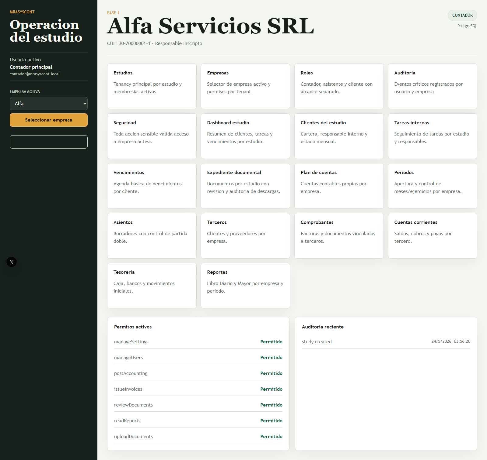
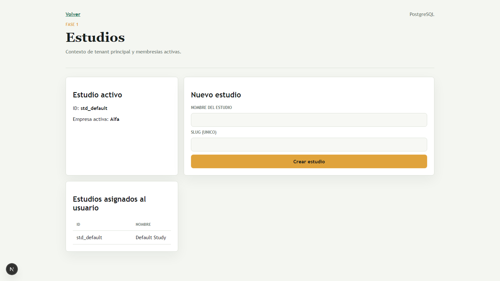
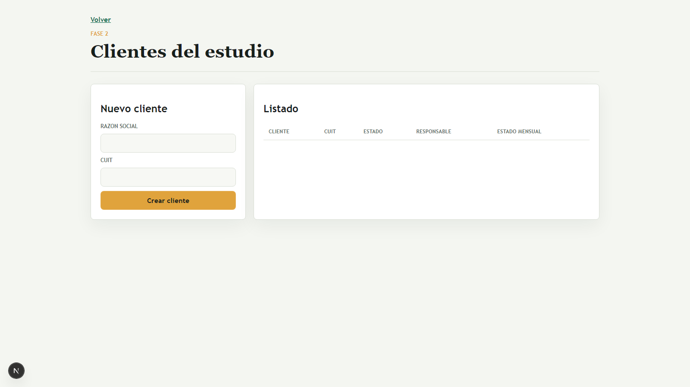
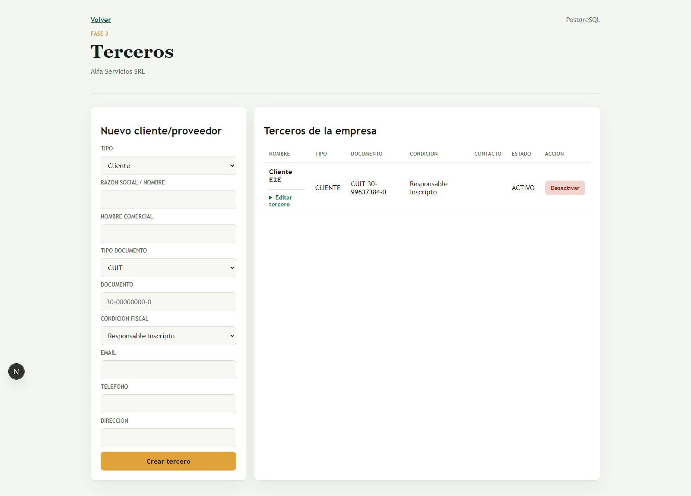
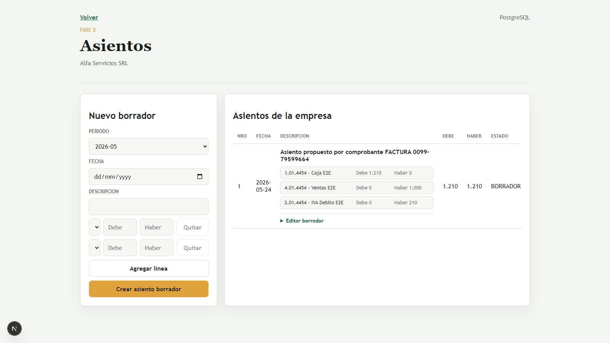

# MRASysCont

Plataforma integral para estudio contable argentino, multi-tenant por **Study -> Client -> Company**, con trazabilidad, seguridad y roadmap por fases.

## Estado actual

- Fase 0.6: GO
- Fase 1: GO
- Fase 2: GO
- Fase 3: GO
- Fase 4: GO
- Fase 5: GO
- Fase 6: GO
- Fase 7: GO
- Fase 8: GO (IVA base)

## Qué incluye hoy

- Seguridad y tenancy real (`studyId`, `companyId`) con autorización backend por objeto.
- Gestión del estudio: clientes, tareas internas, vencimientos y dashboard.
- Terceros y cuentas corrientes por empresa.
- Núcleo contable: cuentas, períodos, asientos, cierres, Diario y Mayor.
- Expediente documental con control de acceso.
- Multimoneda base (ARS/USD) con reglas de precisión decimal.
- Comprobantes locales (A/B/C, NC/ND) con numeración por empresa/PDV.
- IVA base: libros IVA ventas/compras, reporte mensual y exportación CSV/Excel.

## Capturas del sistema

### Dashboard / Inicio



### Administración de estudios



### Administración de empresas


### Gestión de clientes del estudio



### Terceros



### Comprobantes locales


### Asientos contables



### Reportes contables e IVA


## Documentación canónica

- [Roadmap](docs/roadmap.md)
- [Especificación de producto](docs/PRODUCT_SPEC.md)
- [Especificación técnica](docs/TECHNICAL_SPEC.md)
- [Modelo de seguridad](docs/SECURITY_MODEL.md)
- [Autorización por endpoint](docs/ENDPOINT_AUTHORIZATION.md)
- [Tenancy y ambientes](docs/TENANCY_AND_ENVIRONMENTS_CANONICAL.md)
- [Máquina de estados](docs/STATE_MACHINE.md)
- [Cobertura crítica de tests](docs/CRITICAL_TEST_COVERAGE.md)
- [Quality gates de CI](docs/CI_QUALITY_GATES.md)

## Setup local

### Requisitos

- Node.js 20+
- npm 10+
- PostgreSQL 15+ (o Docker)

### Pasos rápidos

```bash
npm install
copy .env.example .env
npm run prisma:generate
npm run db:up
npm run db:migrate
npm run db:seed
npm run dev
```

## Quality gates

```bash
npx prisma validate
npm run db:migration:check
npm run lint
npm run typecheck
npm run test:tenancy
npm run test:permissions
npm test
npm run build
```

## Trabajar en otra PC

```bash
git clone https://github.com/marceloanton/MRASysCont.git
cd MRASysCont
npm install
copy .env.example .env
npm run prisma:generate
npm run db:up
npm run db:migrate
npm run db:seed
npm run dev
```

## Deploy gratuito recomendado

- Frontend/App: Vercel (free)
- PostgreSQL: Neon o Supabase (free)
- Storage documental: Supabase Storage o Cloudflare R2 (free tier)

> Para uso fiscal real, operar con hardening, backups y revisión legal/contable previa.
