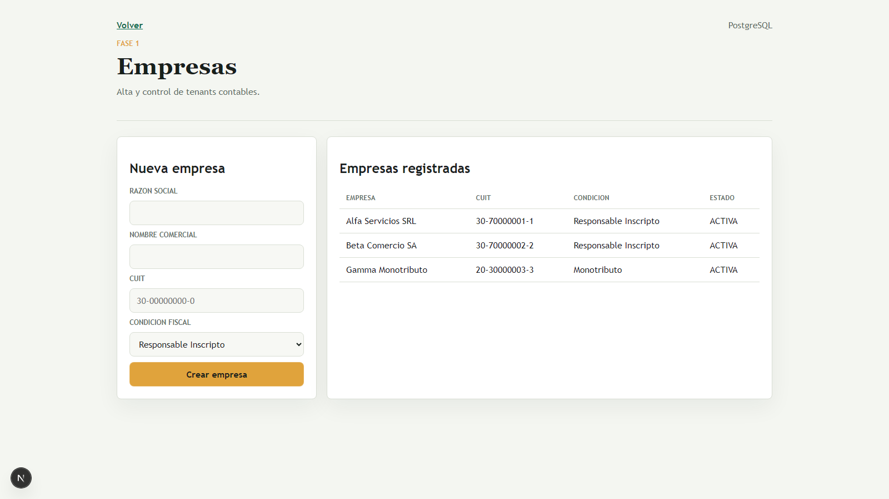
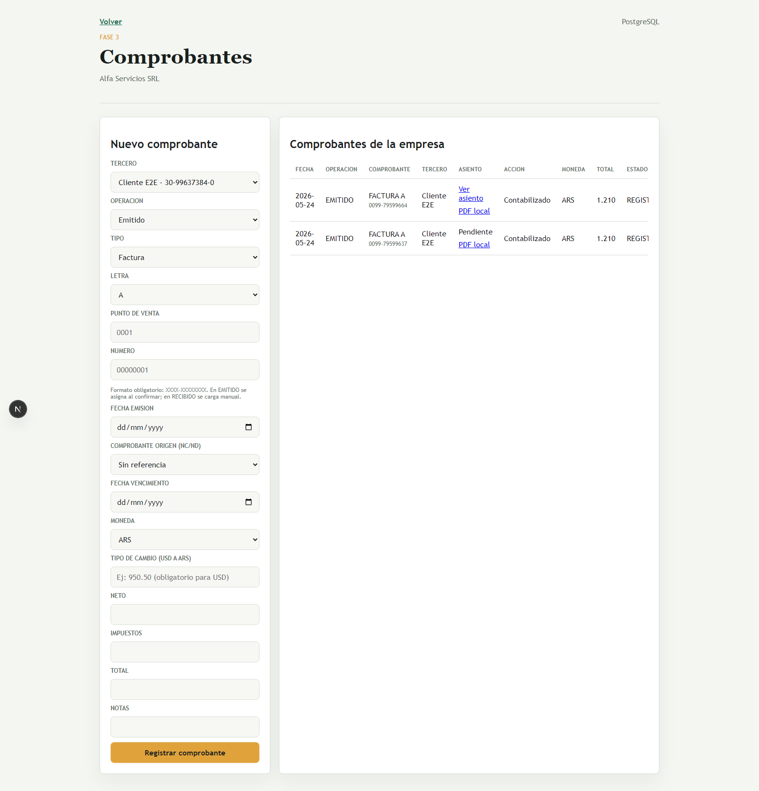
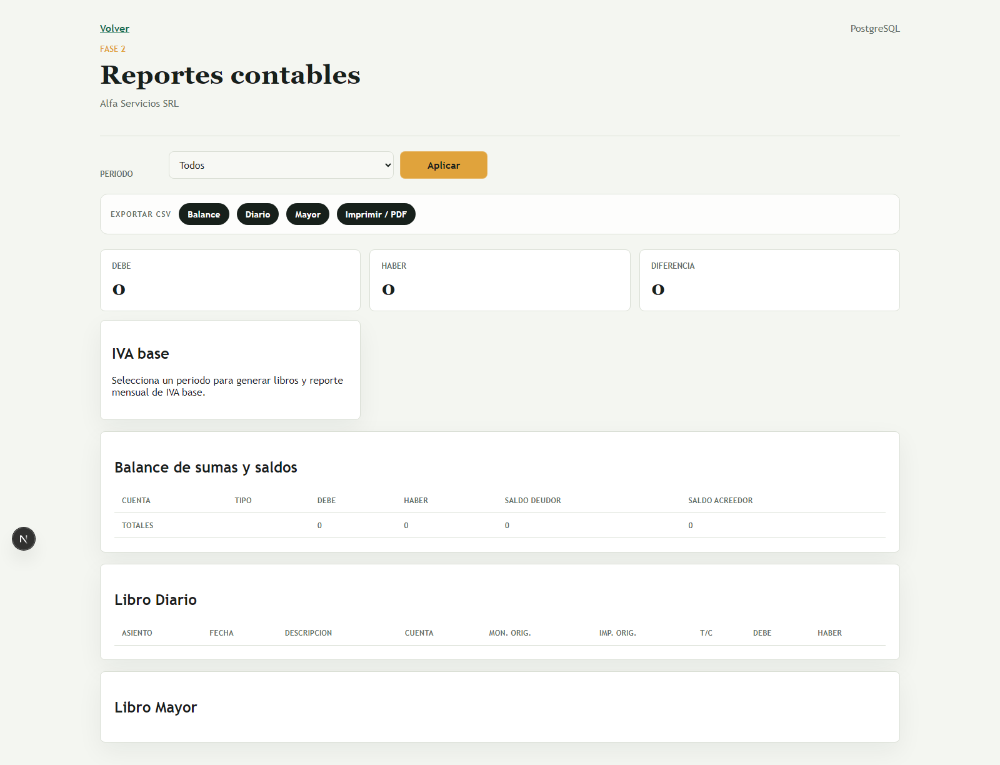

# MRASysCont

Plataforma integral para estudios contables argentinos.

## Demo publica

- Landing: `/publico`
- Producto: `login` con entorno demo/local

## Que resuelve

- Gestion centralizada del estudio contable.
- Operacion multi-tenant con aislamiento por `Study -> Client -> Company`.
- Nucleo contable con reglas estrictas y trazabilidad.
- Comprobantes locales e IVA base en el mismo flujo operativo.

## Estado actual

- Fases 0.6 a 8 cerradas (incluye IVA base).
- Arquitectura multi-tenant orientada a estudio contable.

## Modulos implementados

- Gestion de estudio (clientes, tareas, vencimientos, dashboard)
- Terceros y cuentas corrientes
- Nucleo contable (cuentas, periodos, asientos, cierres, Diario y Mayor)
- Expediente documental
- Multimoneda ARS/USD
- Comprobantes locales
- IVA base (libros, reporte mensual, exportacion y conciliacion)

## Capturas del producto






## Documentacion publica

- [Roadmap público](docs/roadmap.md)
- [Sales one pager](docs/SALES_ONE_PAGER.md)
- [Demo script](docs/DEMO_SCRIPT.md)
- [Pricing público](docs/PRICING_PUBLIC.md)
- [Onboarding offer](docs/ONBOARDING_OFFER.md)
- [FAQ](docs/FAQ.md)
- [Deploy free](docs/DEPLOY_FREE.md)
- [Acceso a docs internas](docs/public/INTERNAL_DOCS_ACCESS.md)

## Puesta en marcha local

```bash
npm install
copy .env.example .env
npm run prisma:generate
npm run db:up
npm run db:migrate
npm run db:seed
npm run dev
```

## Licencia

- Uso de evaluación/no comercial: permitido.
- Uso comercial y facturación real: requiere licencia comercial paga.

Contacto comercial:
- marceloanton@outlook.com
